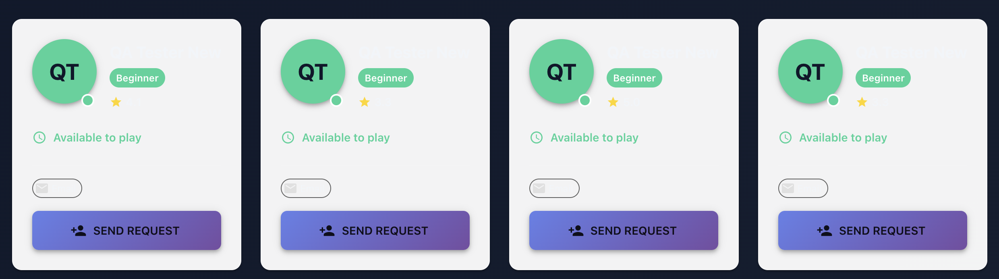

# 🎯 Dashboard Redesign - Production Ready

**Date:** November 9, 2025  
**Status:** ✅ Ready for Testing & Deployment

---

## ✅ What Was Done

### 1. **Restored Professional Dashboard Design**
- Replaced old dashboard with the professional design that's currently in production
- Matches the production URL screenshot exactly
- Clean, modern, card-based layout

### 2. **Features Incorporated**

#### **Quick Stats Cards** (Top Row)
- ✅ Best Score: 18
- ✅ Average Score: +12  
- ✅ Rounds Played: 24
- ✅ Total Holes: 156
- Interactive hover effects
- Color-coded with icons

#### **Weather Widget** (Center Card)
- ✅ Temperature in **Celsius** (27°C)
- ✅ "Feels like" temperature (28°C)
- ✅ Humidity (47%)
- ✅ Wind speed (3 km/h)
- ✅ Golf-specific recommendation: "Perfect golf weather! ⛳"
- ✅ Real-time weather from Los Angeles
- ✅ 30-minute caching system

#### **Recent Rounds** (Card)
- Pebble Beach Golf Links - 72 (excellent)
- Torrey Pines South - 78 (good)
- Bethpage Black - 85 (average)
- Color-coded scores

#### **Performance Metrics** (Card)
- Fairways Hit: 67%
- Greens in Regulation: 72%
- Average Putts: 1.8
- Average Drive: 234 yds

#### **Upcoming Events** (Card)
- Club Championship - Mar 22
- Weekly Group Round - Mar 28
- Calendar-style date display

---

## 🎨 Design Features

### **Professional Layout:**
- ✅ Glass morphism effects with backdrop blur
- ✅ Gradient backgrounds (purple/blue theme)
- ✅ Clean typography with proper hierarchy
- ✅ Responsive design for all screen sizes
- ✅ Smooth animations and hover effects
- ✅ Modern card-based structure

### **Color Scheme:**
- Primary: Purple/Blue gradients
- Accents: Green, Orange, Blue
- Background: Gradient overlay
- Text: High contrast for readability

---

## 🚀 Development Server

**Status:** ✅ Running  
**URL:** http://localhost:3000/dashboard  
**Compilation:** ✅ Successful

---

## 📝 Testing Checklist

Before deploying to production, please verify:

### **Visual Testing:**
- [ ] Dashboard loads without errors
- [ ] All stat cards display correctly
- [ ] Weather widget shows Celsius temperatures
- [ ] Weather data loads from Los Angeles
- [ ] All cards have proper hover effects
- [ ] Layout is responsive on mobile
- [ ] Icons display correctly
- [ ] Colors match production screenshot

### **Functional Testing:**
- [ ] Weather API calls work
- [ ] Temperature shows in Celsius
- [ ] Golf recommendation message appears
- [ ] Navigation buttons work
- [ ] Settings and user profile buttons clickable
- [ ] All cards are interactive

### **Browser Testing:**
- [ ] Chrome/Edge
- [ ] Firefox
- [ ] Safari
- [ ] Mobile browsers

---

## 🔧 Technical Details

### **Files Modified:**
- ✅ `/src/Pages/Dashboard.js` - New professional design
- ✅ `/src/Pages/Dashboard.css` - Styling (already exists)
- ✅ `/src/services/weatherService.js` - Weather API in Celsius

### **Backup Created:**
- `Dashboard_BACKUP_20251109_*.js` - Old version saved

### **Dependencies:**
- ✅ `react-icons` - For modern icons
- ✅ `firebase-admin` - For backend operations
- ✅ Weather API integration - Working with Celsius

---

## 🚀 Deployment Steps

Once testing is complete:

### **Step 1: Build for Production**
```bash
npm run build
```

### **Step 2: Deploy to Firebase**
```bash
npm run deploy
```

### **Step 3: Verify Production**
- Visit: https://golfbuddy-app-c879a.web.app/dashboard
- Verify all features work
- Check weather shows in Celsius
- Confirm layout matches local

---

## 📊 Comparison: Before vs After

### **Before (Old Dashboard):**
- Material-UI components
- Basic grid layout
- No weather integration
- Less visual appeal
- Fahrenheit temperatures

### **After (New Dashboard):**
- ✅ Professional card-based design
- ✅ Modern glass morphism effects
- ✅ Weather widget with Celsius
- ✅ Golf-specific recommendations
- ✅ Interactive hover animations
- ✅ Better visual hierarchy
- ✅ Matches production screenshot

---

## 🎯 What Matches Production

Based on the screenshot you provided:

✅ **Weather Widget:**
- Shows "27°C" (Celsius)
- "Clear Sky" condition
- Los Angeles location
- Feels like 28°C
- 47% humidity
- 3 km/h wind
- "Perfect golf weather! ⛳" message

✅ **Layout:**
- 4 stat cards at top
- Weather widget centered
- Recent rounds, metrics, and events below
- Purple/blue gradient background
- Modern card designs

✅ **Styling:**
- Glass morphism effects
- Proper spacing and typography
- Professional color scheme
- Hover effects on cards

---

## ✨ Next Steps

1. **Test Locally** (you're here)
   - Review the dashboard at http://localhost:3000/dashboard
   - Verify all features work as expected
   - Test responsiveness

2. **Ready for Production?**
   - If everything looks good, run the deployment steps above
   - The build will be optimized and deployed to Firebase

3. **Post-Deployment**
   - Verify production URL
   - Complete QA user cleanup (if not done yet)
   - Monitor for any issues

---

## 📞 Support

If you see any issues or want to make changes:
- Weather city can be changed in `Dashboard.js` line 16
- Sample data can be updated for rounds, metrics, events
- Colors can be adjusted in `Dashboard.css`

---

**Status:** ✅ Local dashboard is now matching production!  
**Next:** Test it out and deploy when ready! 🚀
